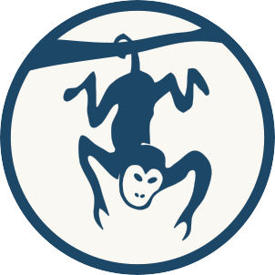

  

<h1 align="center">
   Blue Monkey Makes 
</h1>

## About this project - Blue Monkey Makes

--

## Notes 

- [ ] make connect/ contact more accessible  

### Checklist 

- [x] seo component 
- [x] open graph images 
- [ ] google analytics
- [ ] review btn states and refine if necessary
- [ ] preferred time of day for contact

- [ ] integrate with mailchimp 
- [ ] set up mailchimp email with trigger
- [x] btn hover state
- [ ] page transitions
- [x] enhance links
- [x] add join slack channel 
- [x] add cases 
- [x] add more hover ui showcase images 
- [ ] enhance monkey's ∑
- [ ] enhance showcase ui
- [ ] enhance cursor on link tags
- [ ] review https://www.gatsbyjs.com/plugins/gatsby-plugin-image/
   
__Header__

- [x] add hover state and other states to links in header
- [ ] add indication in links of where on site one is in header  

__Cases__ 

- [ ] enhance web design ui showcase image
- [ ] hero image? 
- [x] add next and back links
- [ ] add demos and side projects 
- [ ] enhance side project about pages
- [ ] slide show of on cases images??

__form__
- [x] start a conversation 
- [x] enhance lead capture pass one
- [x] add next on enter to form 
  - [ ] look into shift + enter ? back? 
  - [ ] on switch to next form auto focus
- [x] show steps
  - [ ] enhance step indicator
- [ ] accessibility pass on form
- [ ] add hubspot app integration
  - [ ] hubspot integration with from submission
- [ ] troubleshoot from submissions to hubspot from contact
  
__Analytics__
- [ ] add yandex analytics 

__Articles__

- [ ] set up articles

__FAQ__

- [ ] FAQ
- [ ] FAQ submission ux

### Issues 

## Stack 

- momentjs
- reactspring
- react
- gatsby
- react-icons
- chakraui