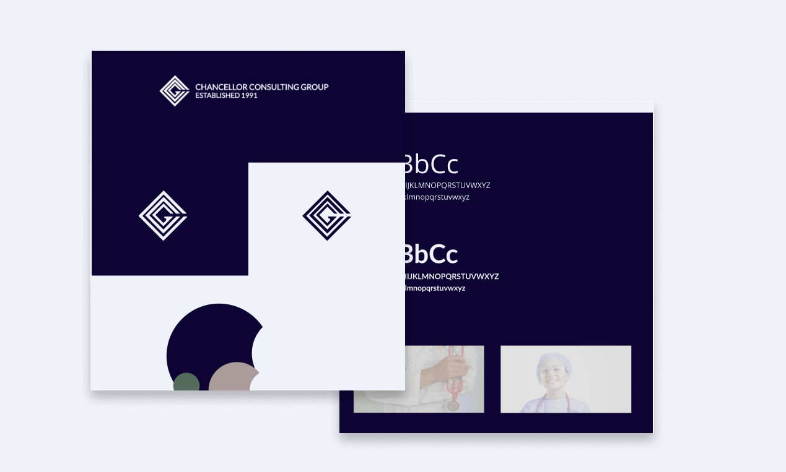

{props.pageContext.frontmatter.title} is a well established healthcare management consutling group with over 35 years in the industry. 

They needed to give their web presense a modern face lift, while maintianing a clean professional tone. This included holding onto some original photography from the 90's.

We wanted to make a digital presence that was modern but convey the well eared reputation and established 

We modernized the brand by leveraging the personality of their mature business. Building off of a the depth of experience refined expertise with a deep navy for trust consistency. We use a warmer tope to offset the powerful blue touching on established confidence and professionalism.

<Heading as="h3">Web Design</Heading>

Once we had the established tone we create an experience for a modern audience with an emphasize on mobile and scalable content and ease of access to points of contact. 

<Box mb={6}></Box>

<Heading as="h3">Development</Heading>

We used Gatsbyjs as our build framework, thus ensuring one of the fastest servicng content. 

<Heading as="h3">Business Integration</Heading>

- Google Analytics 
- Netlify CMS  